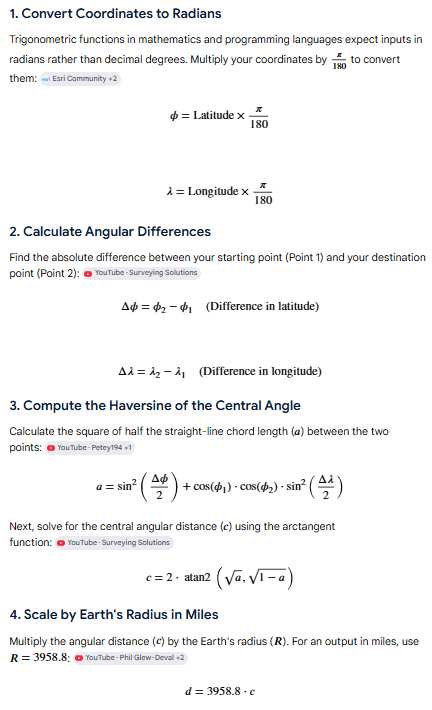

## Distance between point1(lon1,lat1), point2(lon2,lat2)


### Find (distance in mtr, time to travel) between points (Shortest Path Algo )
local fuel optimization engine: walk the route polyline, find nearby stations from SQLite, pick the cheapest stop within each 500-mile window, and compute fuel spend at 10 MPG.



- Add local route geometry helpers to walk the driving polyline, find stations in a corridor, pick the cheapest stop within each 500-mile window, and compute leg fuel costs at 10 MPG.
- Includes unit tests with fixed polylines and no live ORS calls.
- route_geometry: cumulative mile markers, projection, bounding box
- fuel_optimizer: corridor lookup and greedy stop selection
- cost_calculator: per-leg and total USD pricing
- tests: optimizer, geometry, and cost integration coverage

**Route geometry (`services/route_geometry.py`) — 5.1**

| Function | Purpose |
|---|---|
| `haversine_miles()` | Great-circle distance between two lat/lng points |
| `build_cumulative_distances()` | Miles from route start for each polyline vertex |
| `project_point_to_route()` | Project a station onto the nearest route point; returns mile marker + off-route distance |
| `route_bounding_box()` | Lat/lng bounds for a route interval, expanded by corridor buffer |

**Fuel stop optimizer (`services/fuel_optimizer.py`)**

Greedy algorithm:

1. Start at mile 0.
2. If remaining distance ≤ 500 miles, stop (departure tank reaches destination).
3. Search corridor for `[current_position, current_position + 500]`.
4. Pick station with **lowest `retail_price`**; tie-break by distance to route, then mile marker.
5. Advance `current_position` to the chosen stop; exclude already-used stations and require minimum forward progress.
6. Repeat until destination is within range.

**Cost calculator (`services/cost_calculator.py`)**

- `calculate_fuel_costs(fuel_stops, total_distance_miles)` returns per-leg and total USD cost.
- Each leg starts at a fuel stop and ends at the next stop (or destination).
- Formula: `leg_cost = (leg_miles / MPG) × retail_price_at_stop`.
- Assumption documented in code: driver fills at each chosen stop; initial drive to the first stop uses the departure tank (not billed separately).

**Unit tests (`fuel_optimizer/tests/`)**

```bash
python manage.py test fuel_optimizer.tests
# Ran 9 tests — OK
```